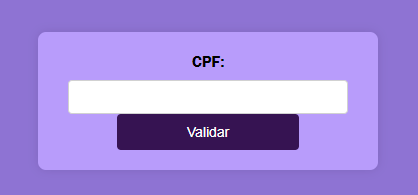
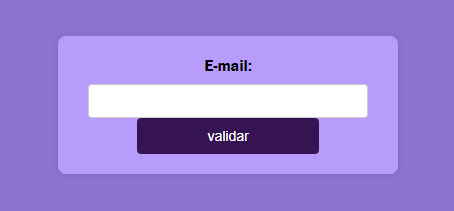

# 🌟 Validador de CPF

 Este é um projeto simples de Validador de CPF utilizando HTML, CSS e JavaScript.

## 📋 Sumário
 
- [Tela final](#tela-final)
- [Funcionalidades](#funcionalidades)
- [Como Usar](#como-usar)
- [Tecnologias Utilizada](#Tecnologias-Utilizada)
- [Autora](#Autora)

## Funcionalidades ✔️

* Validação de CPF: Verifica instantaneamente se um CPF é válido.

Feedback Visual: Indicação visual clara com cores para indicar se o CPF é válido ou inválido.

Design Responsivo: Interface adaptável para uma experiência excelente em diferentes dispositivos.

* Validação de E-mail: Verifica se o E-mail é exitente e se é valido.

Feedback Visual: Indicação visual clara com cores para indicar se o e-mail é válido ou inválido.

Design Responsivo: Interface adaptável para uma experiência excelente em diferentes dispositivos.

## Como Usar 🚀 (E-mail)

Clone o Repositório:

* Copiar código
git clone https://github.com/seu-usuario/validador-cpf-email.git

1- Abra o arquivo index.html no seu navegador favorito.

2- Insira o E-mail:
Digite um e-mail no campo fornecido e clique no botão "Validar".

3- Veja o Resultado:
Receba um feedback imediato abaixo do formulário indicando se o e-mail é válido ou inválido.

## Como Usar 🚀 (CPF)
Clone o Repositório:

* Copiar código
git clone https://github.com/seu-usuario/validador-cpf.git

1- Abra o Projeto:
Abra o arquivo index.html no seu navegador favorito.

2- Insira o CPF:
Digite um CPF no campo fornecido e clique no botão "Validar".

3- Veja o Resultado:
Receba um feedback imediato abaixo do formulário indicando se o CPF é válido ou inválido.

## Tecnologias Utilizadas 🛠️

* HTML - Estrutura básica da página.
* CSS - Estilos para uma aparência agradável.
* nJavaScript - Lógica de validação do CPF.

## Desmonstração

## Autora 📝

Evellin Monteiro da Cruz - Estudante de Desenvolvimento Web

## Notas Importantes 📌
Este projeto foi desenvolvido como parte do curso de Desenvolvimento Web.
Experimente inserir diferentes CPFs para testar a funcionalidade completa do validador.
Sinta-se à vontade para explorar e aprender com o código-fonte disponível neste repositório.

 Este README oferece uma visão geral clara do projeto, orientações para começar, detalhes sobre as tecnologias utilizadas e uma apresentação pessoal como estudante, focando na aprendizagem e no desenvolvimento prático.